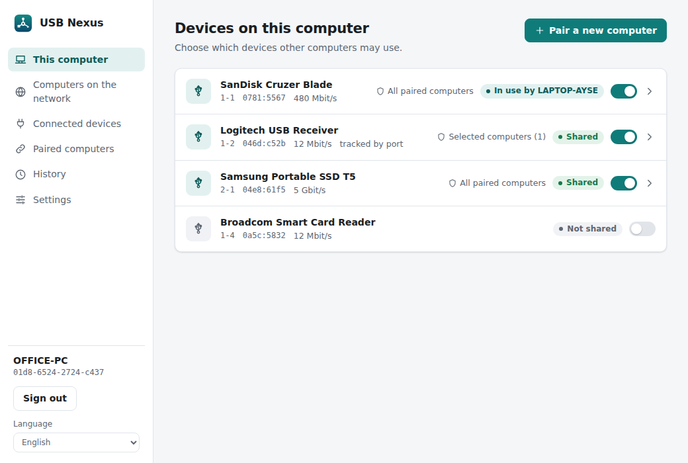
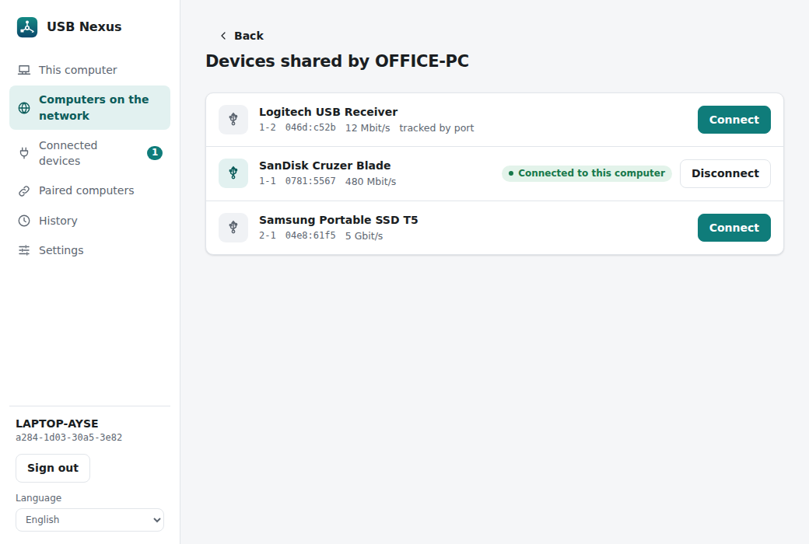
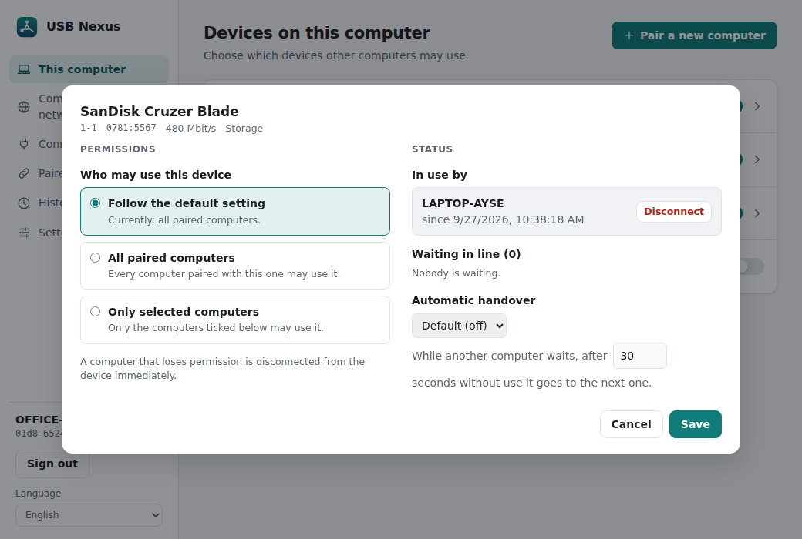
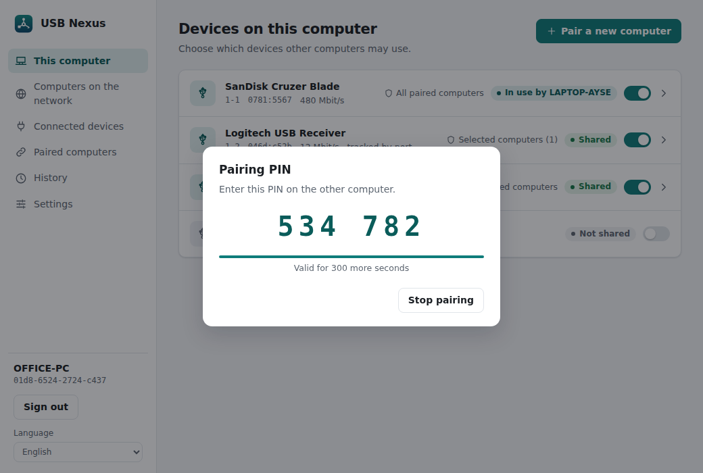
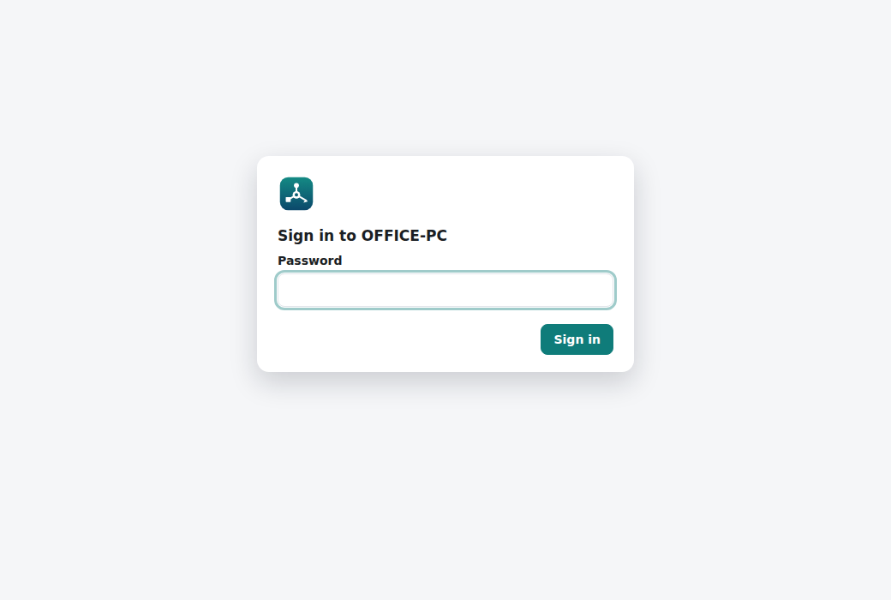
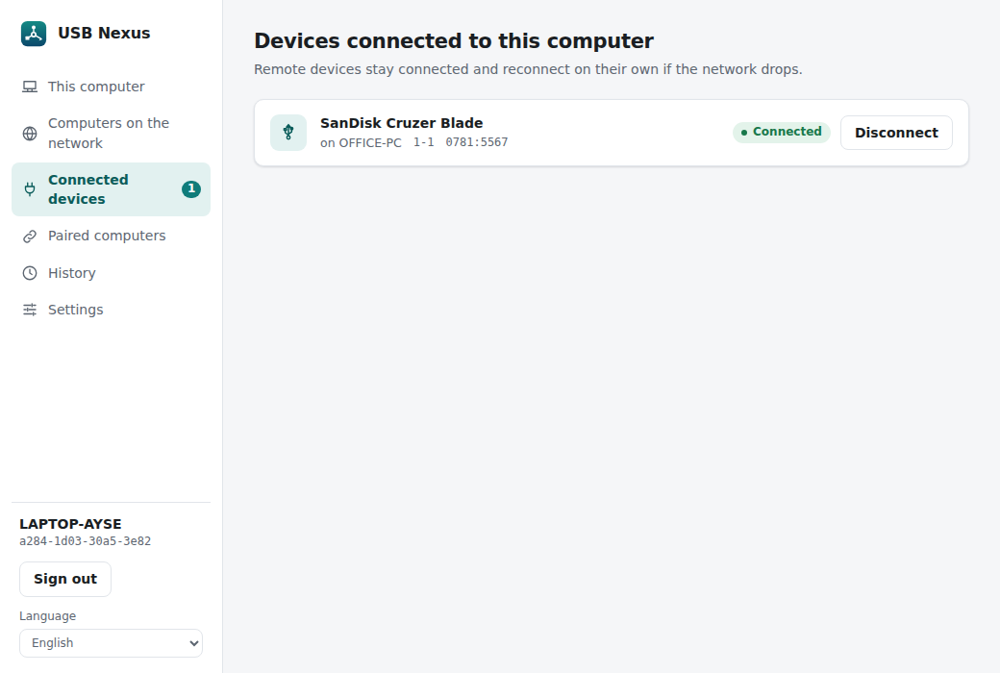

# USB Nexus

**English** · [Türkçe](README.tr.md)

Secure, easy-to-install USB over IP (in development).

- USB devices of one computer are used on another over the network, as if plugged in locally.
- TLS 1.3 with certificate-based mutual authentication; computers are paired once with a PIN.
- Servers on the local network are found automatically (mDNS); connections come back on their own
  after a network drop, a service restart or replugging the device.
- A desktop app (Windows, Linux, macOS), a web interface for headless servers, and installers.
- Interface in English and Turkish, following the operating system's language.

## Layout

| Path | What |
|---|---|
| `crates/usbnexus-proto` | USB/IP wire protocol (written from the specification) |
| `crates/usbnexus-core` | TLS tunnel, PIN pairing, mDNS discovery, automatic reconnection, access control, usage log, web interface, platform backends |
| `crates/usbnexus-i18n` | Interface translations ([Fluent](https://projectfluent.org/)) |
| `crates/usbnexus-cli` | The `usbnexus` command line tool and service |
| `apps/desktop` | Desktop app (Tauri 2; the interface in `apps/desktop/ui` is shared with the web interface) |
| `packaging/linux` | systemd service, deb/rpm scripts |
| `packaging/windows` | Windows service, installer (NSIS) pages, bundled drivers |
| `packaging/macos` | launchd service, `.pkg` build script |
| `locales/` | Translations: `en.ftl`, `tr.ftl` |

## Languages

The interface is available in **English, Turkish, German, Spanish, French, Italian, Portuguese
(Brazil), Russian, Japanese and Simplified Chinese**. The language follows the operating system (on
the command line also `LANG`); `--lang tr` overrides it, and the app has a language box. To add a
language, copy `locales/en.ftl`, translate it, and add it to `LOCALES` and `NSIS_LANGUAGES` in
`crates/usbnexus-i18n/src/lib.rs` and to the Windows installer's language list. The tests fail if
a translation is incomplete. Installer texts are generated from the same files.

## Desktop app

<p align="center"></p>

| | |
|---|---|
|  |  |
|  | |

The app runs as an unprivileged user and asks the **USB Nexus service** (`usbnexus daemon`) in the
background to do the work. Sharing and connections continue when the window is closed; after a
service restart the saved connections are restored.

- **Notification area:** closing the window keeps the app in the notification area (tray); it can
  start automatically at sign-in (Settings → Startup).
- **Troubleshooting:** `usbnexus log debug` makes the service log in detail (`service.log` on
  Windows, the journal on Linux); `usbnexus log info` returns to normal.
- **Roles:** a computer can be a *server* (shares its USB devices), a *client* (uses devices of other
  computers) or both. The screens of a role a computer does not have are hidden; roles are chosen in
  the Windows installer and can be changed under Settings.
- **Device details:** clicking a shared device shows who uses it, who waits in line, and the
  automatic handover and access settings.
- **Queue and automatic handover:** a USB device serves one computer at a time. Others wait in line
  and get the device when it is released. For licence dongles and printers a device that has not
  been used for 30 seconds (adjustable per device) is handed to the next computer in line; storage
  and input devices stay with their user unless set otherwise.

To try it without hardware (simulated devices):

```sh
cargo build -p usbnexus-cli -p usbnexus-desktop
export USBNEXUS_SOCKET=/tmp/usbnexus-demo.sock
target/debug/usbnexus daemon --demo --state-dir /tmp/usbnexus-demo --socket $USBNEXUS_SOCKET &
target/debug/usbnexus-desktop
```

## Installation packages

| Platform | Packages | Notes |
|---|---|---|
| Windows 10/11 | `USB Nexus_*_x64-setup.exe` | [packaging/windows](packaging/windows/README.md): roles, web interface and the bundled drivers are set up by the installer |
| Debian/Ubuntu | `usbnexus_*.deb` (service + CLI), `usb-nexus_*.deb` (desktop app) | [packaging/linux](packaging/linux/README.md) |
| Fedora/RHEL/openSUSE | `usbnexus-*.rpm`, `USB Nexus-*.rpm` | [packaging/linux](packaging/linux/README.md) |
| macOS | `USB Nexus-*.pkg` | [packaging/macos](packaging/macos/README.md) |

Pushing a `v*` tag makes `.github/workflows/release.yml` build all of them and attach them to a
draft GitHub release; the workflow can also be started by hand to get test builds.

## Web interface

| | |
|---|---|
|  |  |

Headless servers (say, a Raspberry Pi sharing a printer) can be managed from a browser. The
interface is the same as the desktop app's; the service serves it over HTTPS. On Windows the
installer sets it up; elsewhere it is **off** until enabled:

```sh
sudo usbnexus web enable          # this computer only: https://localhost:3242 (asks for a password)
sudo usbnexus web enable --lan    # also from other computers on the network
sudo usbnexus web status          # addresses and certificate fingerprint
sudo usbnexus web password        # change the password
sudo usbnexus web disable
```

- The password is stored with Argon2; after 5 wrong attempts from one address, sign-in is locked
  for 60 seconds.
- The certificate is self-signed. On Windows and macOS the service adds it to the computer's own
  trusted certificates, so browsers on that computer open it without a warning; other computers
  (and Linux) see a warning on first use: check the fingerprint shown by `web status`. Typing
  `localhost:3242` without `https://` is redirected.
- The session cookie is `HttpOnly; Secure; SameSite=Strict`; pages are served with a strict CSP.
- The web interface's own settings (on/off, network access, port, password) can be changed in the
  desktop app, on the command line, or in the web interface itself (it warns before a change that
  would cut the current page off).

## Building (for developers)

Users of the packages need none of this; the packages pull in the libraries they need. To build
from source on Linux, install the system libraries first:

```sh
sudo apt install libwebkit2gtk-4.1-dev libayatana-appindicator3-dev librsvg2-dev libxdo-dev
```

```sh
cargo build --release      # outputs: target/release/usbnexus, target/release/usbnexus-desktop
cargo test --workspace
```

## Command line (Linux)

The service installed by the packages loads the kernel modules (`usbip-host`, `vhci-hcd`) itself;
if they are missing, the desktop and web interfaces name the package to install. To try things by
hand without the service:

```sh
# Server (the computer the USB device is plugged into)
sudo modprobe usbip-host                    # only when the service is not running
sudo usbnexus local                         # lists the devices that can be shared
sudo usbnexus serve --export 1-2 --pair     # shares device 1-2 and shows a PIN
sudo usbnexus pin                           # (for a running server) new PIN

# Client (the computer that will use the device)
sudo modprobe vhci-hcd                      # only when the service is not running
sudo usbnexus discover                      # finds servers on the network
sudo usbnexus pair office-pc                # asks for the PIN and pairs (once)
sudo usbnexus list office-pc                # lists shared devices
sudo usbnexus attach office-pc 1-2          # attaches the device; reconnects by itself
```

The connection is encrypted with TLS 1.3. Both sides verify each other with the certificate
fingerprint recorded during PIN pairing. When the server's IP address changes, the client finds it
again on the local network (mDNS) by its fingerprint.

### Devices that are unplugged and replugged

Shared devices are recognised by **VID:PID + serial number**, not by port, so a device stays
shared whichever USB port it is plugged into. Devices without a serial number are tracked by port
(the interface says "tracked by port").

- A shared device that is unplugged stays listed as "not plugged in" and is shared again when it
  returns.
- A client whose device is missing stays "waiting for the device" and attaches by itself when it
  appears.
- The server polls its device list every few seconds. Older settings saved by bus id are migrated
  automatically.

```sh
sudo usbnexus local                                   # DEVICE ID column: 0781:5567:4C5300…
sudo usbnexus attach office-pc 0781:5567:4C5300…      # by identity (a bus id is accepted too)
```

### Access control and usage log

Identity is per computer (the paired certificate). Pairing is always required; on top of that:

- **open** (default): every paired computer may use every shared device;
- **restricted**: per device, only the allowed computers.

Each device can override the default (follow the default / everyone / selected computers only).
The desktop app and the web interface ask on first run which default to use; headless installs
default to **open**. Computers without permission see the device as "no permission"; revoking
permission disconnects an active session immediately.

```sh
sudo usbnexus policy restricted     # or: open; without an argument it shows the current setting
sudo usbnexus history               # pairings, wrong PINs, use, refused requests
sudo usbnexus history --csv > log.csv
```

The usage log is kept in `usage.log`: 90 days (adjustable in Settings), at most 10 MB.

## Platform status

| Scenario | Driver | Status |
|---|---|---|
| Windows server (sharing a device of the PC) | VBoxUSB (Oracle + Microsoft signed, GPL-3.0), bundled | Works (tested on Windows 11) |
| Windows client | usbip-win2 (Microsoft attestation signed, BSD-2-Clause), bundled | Works (tested on Windows 11; [details](packaging/windows/README.md)) |
| Linux server ↔ Linux client | The kernel's `usbip-host` / `vhci-hcd` | Written; hardware test pending |
| Desktop app | Tauri; Windows: named pipe to the service, Linux/macOS: Unix socket | Windows tested; Linux/macOS pending |
| Web interface | Served by the service over HTTPS | Tested (local and LAN) |
| macOS server | libusb (bundled) | Written; devices macOS uses with its own driver excluded ([details](packaging/macos/README.md)) |
| macOS client | — | Not possible (Apple does not allow third-party virtual USB controllers) |

## License

USB Nexus is free software, licensed under the [GNU General Public License v3.0](LICENSE) or (at
your option) any later version (`GPL-3.0-or-later`).
