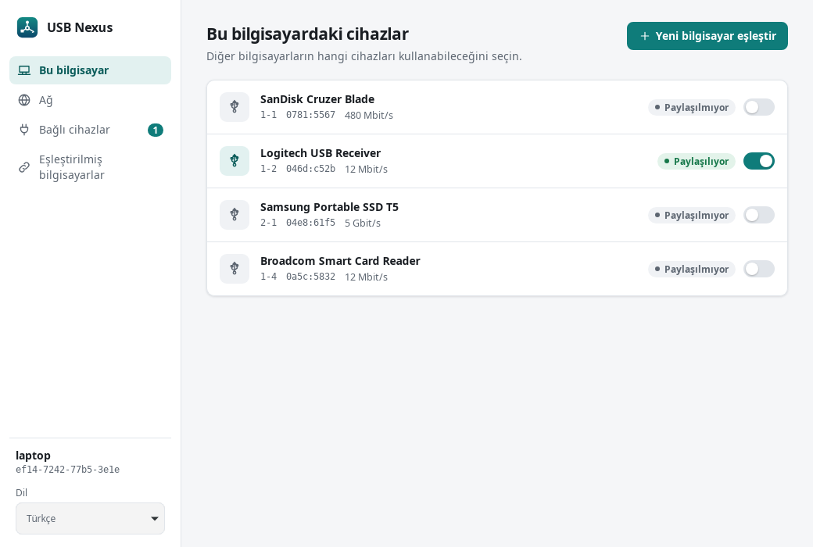
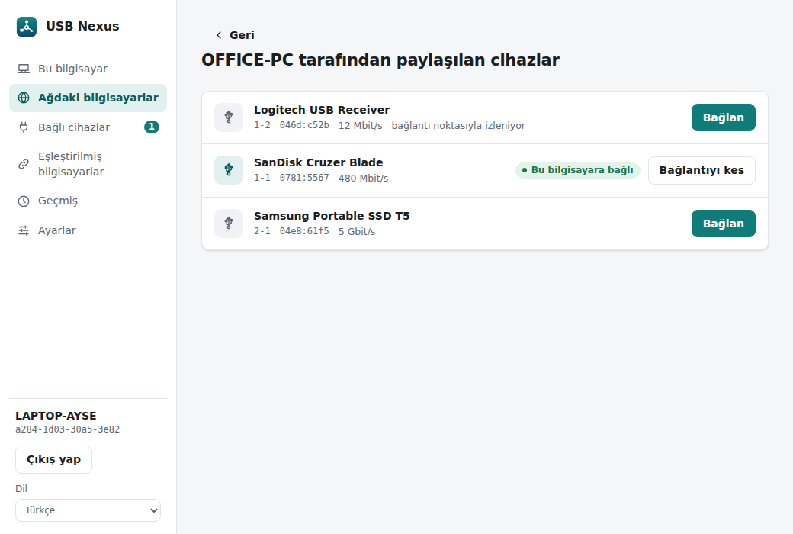
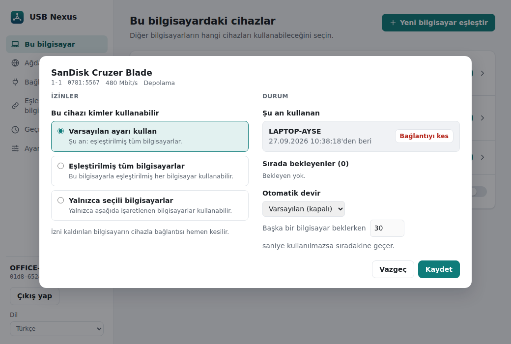
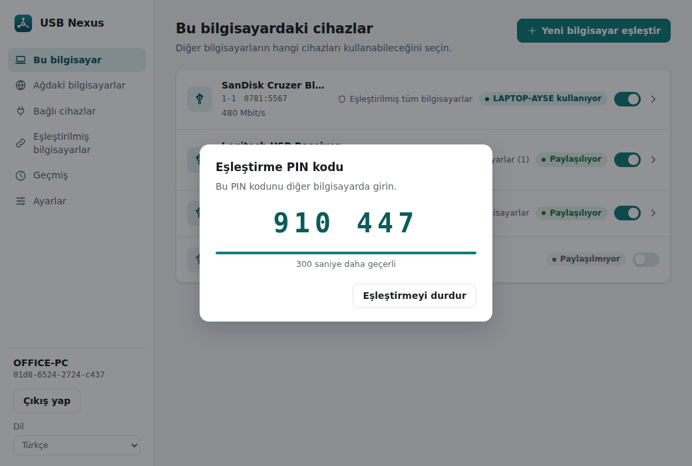
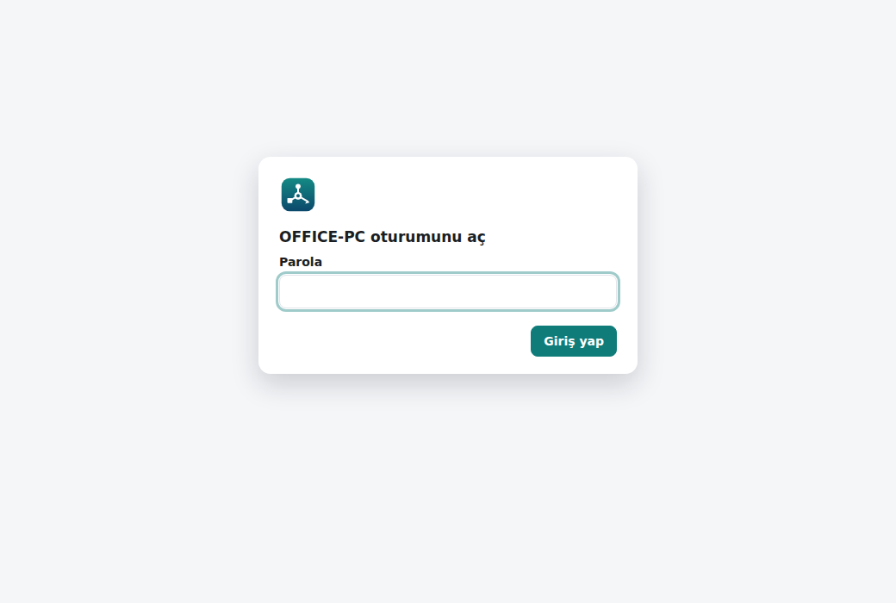
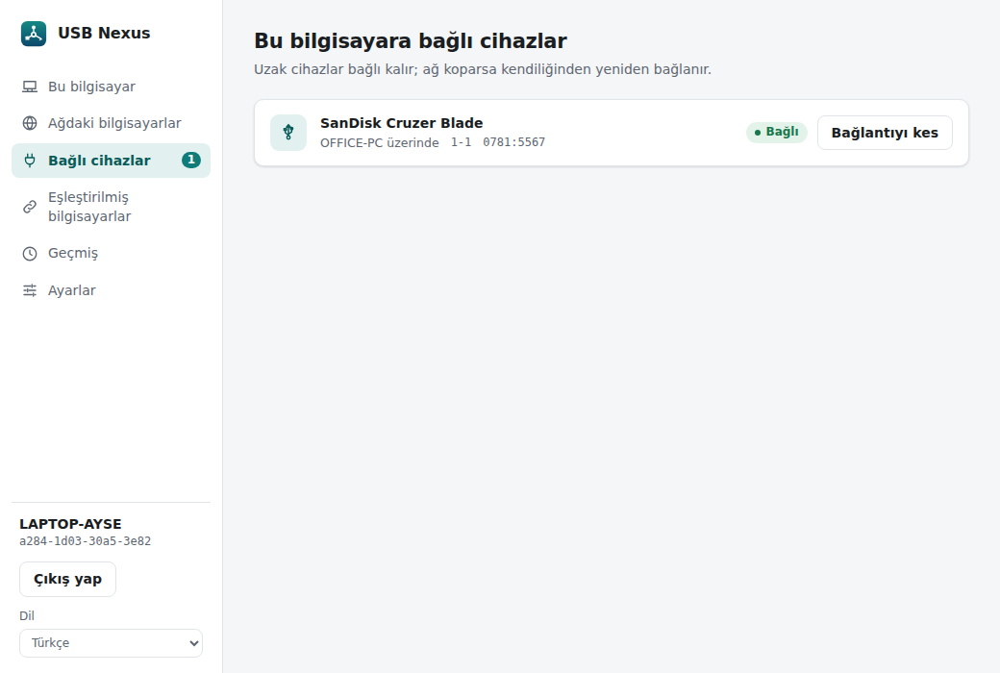

# USB Nexus

[English](README.md) · **Türkçe**

Güvenli, kolay kurulan USB-over-IP çözümü (geliştirme aşamasında).

- Bir bilgisayarın USB cihazları ağ üzerinden başka bir bilgisayarda, oraya takılıymış gibi kullanılır.
- TLS 1.3 ve sertifika tabanlı karşılıklı kimlik doğrulama; bilgisayarlar bir kez PIN ile eşleştirilir.
- Ağdaki sunucular kendiliğinden bulunur (mDNS); ağ kopmasında, hizmet yeniden başladığında ya da cihaz
  çıkarılıp takıldığında bağlantılar kendiliğinden geri kurulur.
- Masaüstü uygulaması (Windows, Linux, macOS), ekransız sunucular için web arayüzü ve kurulum paketleri.
- Arayüz Türkçe ve İngilizce; işletim sisteminin dilini izler.

## Yapı

| Yol | Ne |
|---|---|
| `crates/usbnexus-proto` | USB/IP kablo protokolü (spesifikasyondan sıfırdan yazıldı) |
| `crates/usbnexus-core` | TLS tüneli, PIN ile eşleştirme, mDNS ile bulma, otomatik yeniden bağlanma, erişim denetimi, kullanım kaydı, web arayüzü, platform arka uçları |
| `crates/usbnexus-i18n` | Arayüz çevirileri ([Fluent](https://projectfluent.org/)) |
| `crates/usbnexus-cli` | `usbnexus` komut satırı aracı ve hizmet |
| `apps/desktop` | Masaüstü uygulaması (Tauri 2; `apps/desktop/ui` içindeki arayüz web arayüzüyle ortak) |
| `packaging/linux` | systemd hizmeti, deb/rpm betikleri |
| `packaging/windows` | Windows hizmeti, kurulum (NSIS) sayfaları, pakete eklenen sürücüler |
| `packaging/macos` | launchd hizmeti, `.pkg` üretme betiği |
| `locales/` | Çeviri dosyaları: `en.ftl`, `tr.ftl` |

## Diller

Arayüz **Türkçe, İngilizce, Almanca, İspanyolca, Fransızca, İtalyanca, Portekizce (Brezilya), Rusça,
Japonca ve Basitleştirilmiş Çince**. Dil işletim sisteminden alınır (komut satırında ayrıca `LANG`);
`--lang tr` ile değiştirilebilir, uygulamada da bir dil kutusu vardır. Yeni bir dil eklemek için
`locales/en.ftl` dosyasını kopyalayıp çevirin, `crates/usbnexus-i18n/src/lib.rs` içindeki `LOCALES` ve
`NSIS_LANGUAGES` listelerine ve Windows kurulumunun dil listesine ekleyin. Eksik çeviri olursa testler
başarısız olur. Kurulum metinleri de aynı dosyalardan üretilir.

## Masaüstü uygulaması

<p align="center"></p>

| | |
|---|---|
|  |  |
|  | |

Uygulama yetkisiz bir kullanıcı olarak çalışır ve tüm işleri arka plandaki **USB Nexus hizmetine**
(`usbnexus daemon`) yaptırır. Pencere kapatılsa bile paylaşımlar ve bağlantılar sürer; hizmet yeniden
başladığında kayıtlı bağlantılar kendiliğinden geri kurulur.

- **Bildirim alanı:** Pencere kapatılınca uygulama bildirim alanında (tepside) kalır; oturum açılınca
  kendiliğinden başlayabilir (Ayarlar → Başlangıç).
- **Sorun giderme:** `usbnexus log debug` hizmetin ayrıntılı günlük tutmasını sağlar (Windows'ta
  `service.log`, Linux'ta journal); `usbnexus log info` normale döndürür.
- **Kullanım şekli (roller):** Bir bilgisayar *sunucu* (USB cihazlarını paylaşır), *istemci* (başka
  bilgisayarların cihazlarını kullanır) ya da ikisi birden olabilir. Seçilmeyen rolün ekranları gizlenir;
  roller Windows kurulumunda seçilir, Ayarlar'dan değiştirilebilir.
- **Cihaz ayrıntıları:** Paylaşılan bir cihaza tıklayınca kimin kullandığı, sırada kimlerin beklediği,
  otomatik devir ve izin ayarları görünür.
- **Sıra ve otomatik devir:** Bir USB cihazını aynı anda tek bilgisayar kullanabilir. Diğerleri sıraya
  girer ve cihaz bırakılınca alır. Lisans dongle'ı ve yazıcılarda 30 saniye (cihaz başına ayarlanabilir)
  kullanılmayan cihaz sıradakine devredilir; bellek ve klavye/fare gibi cihazlar aksi seçilmedikçe
  kullananda kalır.

Donanım olmadan denemek için (demo cihazlarla):

```sh
cargo build -p usbnexus-cli -p usbnexus-desktop
export USBNEXUS_SOCKET=/tmp/usbnexus-demo.sock
target/debug/usbnexus daemon --demo --state-dir /tmp/usbnexus-demo --socket $USBNEXUS_SOCKET &
target/debug/usbnexus-desktop
```

## Kurulum paketleri

| Platform | Paketler | Notlar |
|---|---|---|
| Windows 10/11 | `USB Nexus_*_x64-setup.exe` | [packaging/windows](packaging/windows/README.tr.md): roller, web arayüzü ve pakete eklenen sürücüler kurulumda ayarlanır |
| Debian/Ubuntu | `usbnexus_*.deb` (hizmet + komut satırı), `usb-nexus_*.deb` (masaüstü) | [packaging/linux](packaging/linux/README.tr.md) |
| Fedora/RHEL/openSUSE | `usbnexus-*.rpm`, `USB Nexus-*.rpm` | [packaging/linux](packaging/linux/README.tr.md) |
| macOS | `USB Nexus-*.pkg` | [packaging/macos](packaging/macos/README.tr.md) |

Bir `v*` sürüm etiketi gönderildiğinde `.github/workflows/release.yml` hepsini üretir ve taslak bir
GitHub sürümüne ekler; deneme paketleri için iş akışı elle de başlatılabilir.

## Web arayüzü

| | |
|---|---|
|  |  |

Ekransız sunucular (ör. yazıcı paylaşan bir Raspberry Pi) tarayıcıdan yönetilebilir. Arayüz masaüstü
uygulamasıyla aynıdır; hizmet tarafından HTTPS ile sunulur. Windows'ta kurulum ayarlar; diğerlerinde
açılana kadar **kapalıdır**:

```sh
sudo usbnexus web enable          # yalnızca bu bilgisayardan: https://localhost:3242 (parola sorar)
sudo usbnexus web enable --lan    # ağdaki diğer bilgisayarlardan da
sudo usbnexus web status          # adresler ve sertifika parmak izi
sudo usbnexus web password        # parolayı değiştir
sudo usbnexus web disable
```

- Parola Argon2 ile saklanır; aynı adresten 5 hatalı denemeden sonra giriş 60 saniye kilitlenir.
- Sertifika kendinden imzalıdır. Windows ve macOS'ta hizmet sertifikayı bilgisayarın güvenilen
  sertifikalarına ekler; o bilgisayardaki tarayıcılar uyarısız açar. Başka bilgisayarlar (ve Linux) ilk
  girişte uyarır; `web status` çıktısındaki parmak iziyle doğrulayın. `https://` yazmadan
  `localhost:3242` yazılırsa yönlendirilir.
- Oturum çerezi `HttpOnly; Secure; SameSite=Strict`, sayfalar sıkı bir CSP ile sunulur.
- Web arayüzünün kendi ayarları (açık/kapalı, ağdan erişim, port, parola) masaüstü uygulamasından,
  komut satırından ya da web arayüzünün kendisinden değiştirilebilir (bu sayfayı erişilemez kılacak bir
  değişiklikten önce uyarır).

## Derleme (geliştiriciler için)

Kurulum paketlerini kullananların bu bölümle işi yok; paketler gereken kütüphaneleri kendileri
kurar. Kaynak koddan derlemek için Linux'ta önce sistem kütüphaneleri gerekir:

```sh
sudo apt install libwebkit2gtk-4.1-dev libayatana-appindicator3-dev librsvg2-dev libxdo-dev
```

```sh
cargo build --release      # çıktılar: target/release/usbnexus, target/release/usbnexus-desktop
cargo test --workspace
```

## Komut satırından kullanım (Linux)

Paketle kurulan hizmet çekirdek modüllerini (`usbip-host`, `vhci-hcd`) kendisi yükler; eksiklerse
masaüstü ve web arayüzü kurulacak paketi söyler. Hizmet olmadan, elle denemek için:

```sh
# Sunucu (USB cihazının takılı olduğu bilgisayar)
sudo modprobe usbip-host                    # yalnızca hizmet çalışmıyorsa
sudo usbnexus local                         # paylaşılabilecek cihazları listeler
sudo usbnexus serve --export 1-2 --pair     # 1-2 cihazını paylaşır, PIN gösterir
sudo usbnexus pin                           # (çalışan sunucu için) yeni PIN üretir

# İstemci (cihazı kullanacak bilgisayar)
sudo modprobe vhci-hcd                      # yalnızca hizmet çalışmıyorsa
sudo usbnexus discover                      # ağdaki sunucuları bulur
sudo usbnexus pair ofis-pc                  # PIN sorar ve eşleştirir (bir kez)
sudo usbnexus list ofis-pc                  # paylaşılan cihazları listeler
sudo usbnexus attach ofis-pc 1-2            # cihazı bağlar; bağlantı koparsa kendisi yeniden bağlanır
```

Bağlantı TLS 1.3 ile şifrelenir. İki taraf da birbirini PIN ile eşleştirme sırasında kaydedilen sertifika
parmak iziyle doğrular. Sunucunun IP adresi değişse bile istemci onu yerel ağda (mDNS) parmak izinden
yeniden bulur.

### Takılıp çıkarılan cihazlar

Paylaşılan cihazlar bağlantı noktasıyla değil **VID:PID + seri numarasıyla** tanınır; cihaz hangi USB
bağlantı noktasına takılırsa takılsın paylaşılmaya devam eder. Seri numarası olmayan cihazlar
bağlantı noktasından izlenir (arayüzde "bağlantı noktasıyla izleniyor" notu görünür).

- Çıkarılan paylaşılmış cihaz listede "takılı değil" olarak kalır, geri takılınca yeniden paylaşılır.
- İstemci cihaz yoksa "cihaz bekleniyor" durumunda kalır ve cihaz takılınca kendiliğinden bağlanır.
- Sunucu cihaz listesini birkaç saniyede bir yoklar. Eski (bus id ile kaydedilmiş) ayarlar kendiliğinden
  taşınır.

```sh
sudo usbnexus local                                   # CİHAZ KİMLİĞİ sütunu: 0781:5567:4C5300…
sudo usbnexus attach ofis-pc 0781:5567:4C5300…        # kimlikle (bus id de kabul edilir)
```

### Erişim denetimi ve kullanım kaydı

Kimlik bilgisayar başınadır (eşleştirilmiş sertifika). Eşleştirme her zaman gereklidir; üstüne:

- **açık** (varsayılan): eşleştirilmiş her bilgisayar paylaşılan her cihazı kullanabilir;
- **kısıtlı**: her cihaz için yalnızca izin verilen bilgisayarlar kullanabilir.

Her cihaz bu varsayılanı değiştirebilir (varsayılanı izle / herkes / yalnızca seçili bilgisayarlar).
Masaüstü uygulaması ve web arayüzü ilk açılışta hangisinin kullanılacağını sorar; ekransız
kurulumlarda varsayılan **açık**tır. İzni olmayan bilgisayarlar cihazı "izin yok" olarak görür; izin
kaldırıldığında etkin bağlantı hemen kesilir.

```sh
sudo usbnexus policy restricted     # veya: open; parametresiz çalıştırınca mevcut ayarı gösterir
sudo usbnexus history               # eşleştirmeler, yanlış PIN'ler, kullanım, reddedilen istekler
sudo usbnexus history --csv > kayit.csv
```

Kullanım kaydı `usage.log` dosyasında tutulur: 90 gün (Ayarlar'dan değiştirilebilir), en fazla 10 MB.

## Platform durumu

| Senaryo | Sürücü | Durum |
|---|---|---|
| Windows sunucu (bilgisayardaki cihazı paylaşma) | VBoxUSB (Oracle + Microsoft imzalı, GPL-3.0), pakette | Çalışıyor (Windows 11'de denendi) |
| Windows istemci | usbip-win2 (Microsoft attestation imzalı, BSD-2-Clause), pakette | Çalışıyor (Windows 11'de denendi; [ayrıntılar](packaging/windows/README.tr.md)) |
| Linux sunucu ↔ Linux istemci | Çekirdekteki `usbip-host` / `vhci-hcd` | Yazıldı; donanım testi bekliyor |
| Masaüstü uygulaması | Tauri; Windows'ta hizmetle adlandırılmış kanal, Linux/macOS'ta Unix soketi | Windows'ta denendi; Linux/macOS bekliyor |
| Web arayüzü | Hizmet tarafından HTTPS ile sunulur | Denendi (yerel ve ağdan) |
| macOS sunucu | libusb (programa gömülü) | Yazıldı; macOS'un kendi sürücüsünü kullandığı cihazlar hariç ([ayrıntılar](packaging/macos/README.tr.md)) |
| macOS istemci | — | Mümkün değil (Apple sanal USB denetleyiciye izin vermiyor) |

## Lisans

USB Nexus özgür yazılımdır: [GNU Genel Kamu Lisansı sürüm 3](LICENSE) veya (tercihinize göre) daha sonraki
bir sürümün koşulları altında yeniden dağıtabilir ve/veya değiştirebilirsiniz (`GPL-3.0-or-later`).
